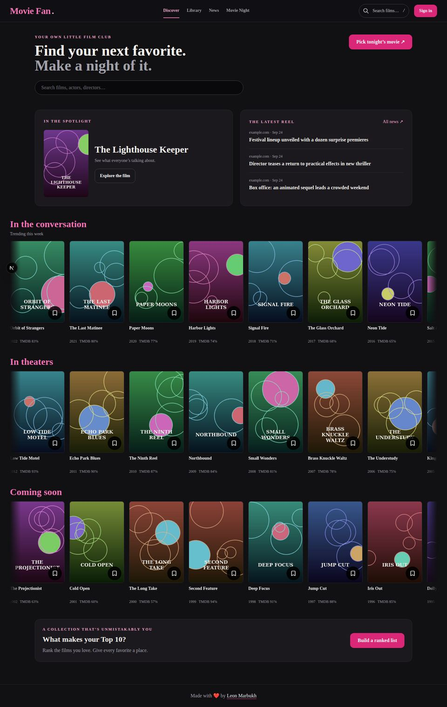
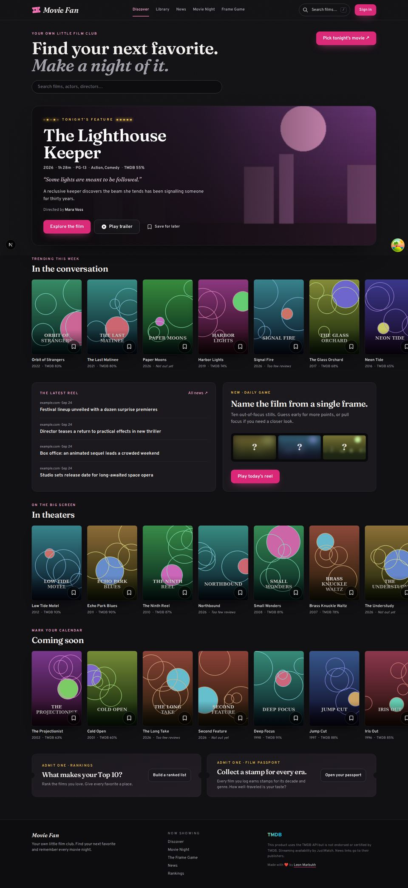
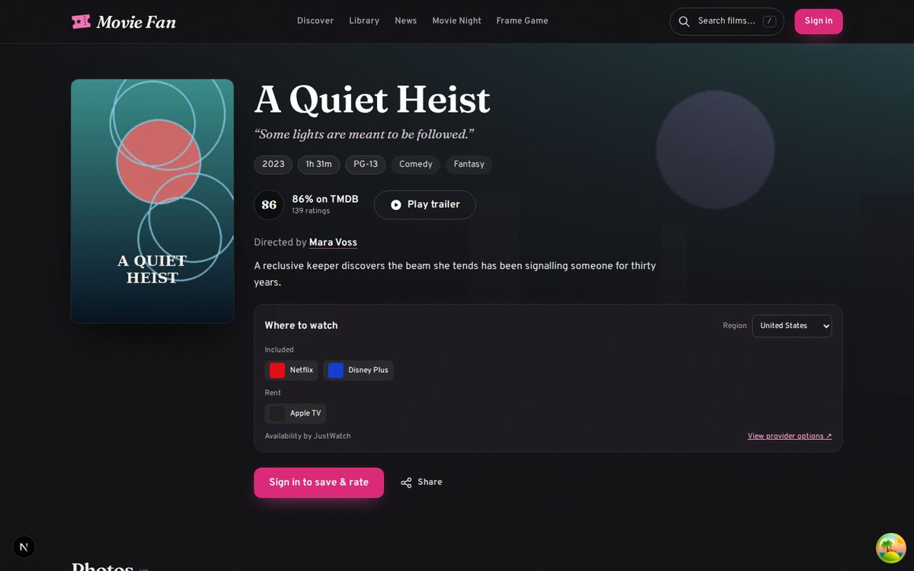
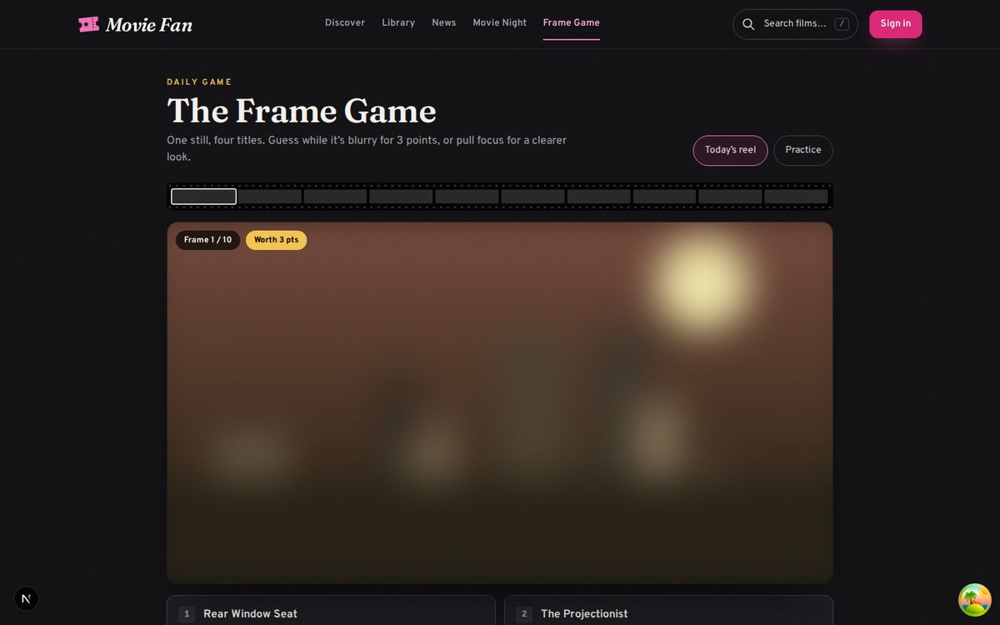
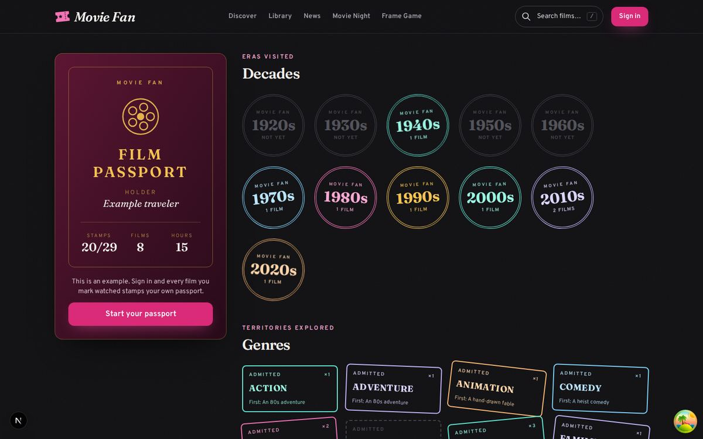
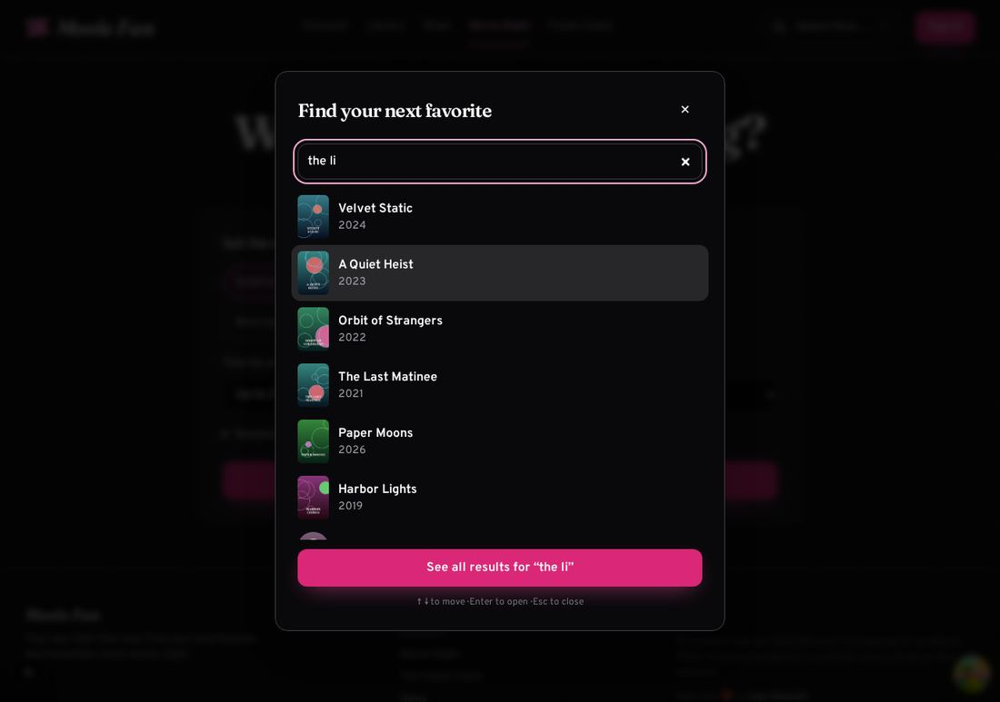
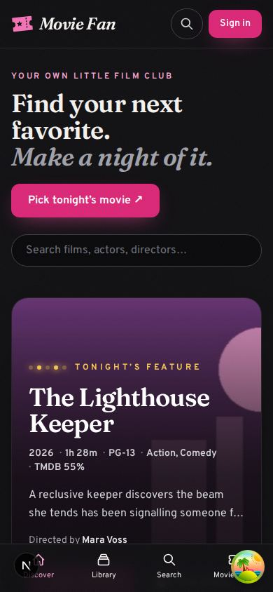

# Movie Fan audit — September 24, 2026

Branch: `claude/audit-refresh` (not pushed, not deployed). Four commits sit on top of `main`:

1. **Snapshot of the After Hours Film Club release.** The Sep 5 release was deployed to Netlify but never committed. It is committed here as-is.
2. **Cut serverless renders and page weight.**
3. **Add the Frame Game and Film Passport.**
4. **Refresh the design, add instant search, and stop showing 0% scores.**

## Where things stand

| | |
|---|---|
| **Production** | Vercel, `movie-fan-orcin.vercel.app`, auto-deploys `main`. Last deploy: #32 on Sep 18. Up. |
| **Netlify** | `movie-fan-978.netlify.app` is paused ("Site not available… reached its usage limits"). The free plan has a hard cap of 300 credits a month, and each production deploy costs 15. Its last deploy was a manual CLI deploy on Sep 5. |
| **#32 rate limits** | Only `netlify.toml` changed. Vercel ignores that file, so the limits do nothing in production. They would also have throttled real visitors, because one home-page visit prefetched 26 movie pages. |
| **Film Club redesign** | Has only ever run on Netlify. Merging this branch ships it to Vercel for the first time. Its three migrations are already applied to the production DB, per `docs/implementation/PROGRESS.md`. |
| **Vercel firewall** | No config on the project, so no bot protection. |

## The big finding: movie pages were never cached

`/movie/[id]`, `/person/[slug]` and `/genre/[slug]` export `revalidate`, which looks like ISR. They don't export `generateStaticParams`, though, so Next 15 builds them as fully dynamic routes. Every page view, every crawler hit and every link prefetch ran a fresh serverless render, each with TMDB and OMDb round trips. That fits the July usage alerts: 36k `/person/*` renders in a day, 100% of edge requests, 75% of function duration.

Measured against a production build (`next build` + `next start`) with offline TMDB fixtures:

| | Before | After |
|---|---|---|
| `/movie/[id]` in the build | `ƒ` Dynamic | `●` SSG, on-demand ISR |
| Movie page `Cache-Control` | `private, no-cache, no-store` | `s-maxage=86400, stale-while-revalidate` |
| Repeat request to the same movie | New render | `x-nextjs-cache: HIT` |
| `/movie/*` requests from one guest home visit (load + one scroll) | 26 prefetch renders | 0 |
| Localhost requests for that visit | 55 | 35 |

## What changed

### Cost and performance
- An empty `generateStaticParams` on movie, person and genre routes. That turns on on-demand ISR, so Vercel's CDN serves repeat views.
- `prefetch={false}` on every link to `/movie`, `/person`, `/genre`, `/u` and `/lists`. Clicks still go straight to the page, and `loading.tsx` skeletons still appear instantly.
- React Query now keeps data for 60s and doesn't refetch on window focus. The session also no longer refetches on focus. Each of those refetches was a function call.
- `robots.txt` now disallows GPTBot, ClaudeBot, CCBot, Bytespider, Amazonbot, PerplexityBot and other AI crawlers. It also keeps app-only routes out of the index.
- TMDB images are right-sized: w185 headshots, w92 logos, w342 card posters and w1280 backdrops (was `original`, often 4K). Because image optimization is intentionally off, the size in the URL is exactly what the browser downloads.
- The placeholder poster PNG (344 KB) is now an SVG (under 1 KB). The sign-in art went from 483 KB to 69 KB and no longer preloads on phones, where it's hidden. Six unused public assets are removed.
- Fonts are self-hosted from npm with `next/font/local`, so builds no longer fail when Google Fonts can't be reached.
- Trailers load from `youtube-nocookie.com`, and only after you click play.

### Correctness and compliance
- **No more "TMDB 0%".** `describeScore()` handles every case:
  - no votes: "No reviews yet"
  - unreleased: "Not out yet"
  - fewer than 10 votes: "Too few reviews"
  
  It's used on cards, the movie page and the home feature. JSON-LD now only includes a rating people actually gave.
- **TMDB attribution** is now in the footer. TMDB's API terms require it.

### Design ("After Hours Film Club", finished)
- One design system instead of two layers of CSS overriding each other. Tokens: `ink`, `cream`, `gold`, and Tailwind pink for actions.
- Fraunces for display type, Overpass for the interface. Subtle static film grain, marquee bulbs and ticket-stub cards.
- Shelves now line up with the page column. Before, rows were 2xl-wide while the page was xl-wide, and a mask clipped the first poster.
- The home page has a cinematic **Tonight's feature** marquee: backdrop, tagline, facts, director, trailer and save.
- The movie page has a clearer hero with the tagline under the title. The trailer opens in a dialog, and the director links to their page. Actions are split into a primary row and a quiet row.
- Search is now a **live command palette** (press `/`): posters and people appear as you type, and you can move through them with the arrow keys.
- Build-time Open Graph images for the site and the game.

### New features
- **The Frame Game** (`/play`): name the film from one out-of-focus still.
  - Ten frames a day, and everyone gets the same reel. A guess while the still is blurry scores 3 points, and "pull focus" gives a clearer look for fewer.
  - Keyboard play, a spoiler-free emoji share card, end credits and a practice mode.
  - It's a static ISR page, so playing costs nothing on the server.
- **Film Passport** (`/passport`): stamps for every decade and genre you've watched, plus milestone "visas".
  - The milestones are Time Traveler, Auteur Tracker, Marathoner, Archivist, Centurion and Critic.
  - It's computed from the library query the app already makes, so no new requests. Guests see an example passport.

## Recommendations I didn't implement

These need your call or account access:

1. **Turn on Vercel Firewall → "AI Bots" managed rule.** It's free on Hobby and catches the crawlers that ignore `robots.txt`.
2. **Pick one host.** If Vercel stays, delete the Netlify site and `netlify.toml`, and drop the `.vercel/netlify-release.json` leftovers.
3. **`/api/auth/session` is fetched twice per page load, even for guests.** That's two function calls per visit. Worth checking whether both come from `SessionProvider`, or whether the session can be seeded from the server for signed-in pages.
4. **Invalid movie IDs return a 200 "not found" page with `noindex`**, not a 404. This is because `loading.tsx` starts streaming before `notFound()` runs. It's harmless for SEO. A real 404 means dropping the route's `loading.tsx`, which would lose the instant skeleton.
5. **The members' home "available tonight" shelf** checks up to 50 titles against TMDB on each visit, cached 1h per fetch. A daily per-user snapshot in the DB would make it free after the first check.
6. **`next lint` is deprecated** in Next 15.5 and goes away in 16. Migrate with `npx @next/codemod@canary next-lint-to-eslint-cli .`.
7. Next ideas from the UX plan that fit the new style: **Double Feature** pairings on movie pages, a **poster-collage export** for ranked lists, and **pinned lists** on public profiles.

## How this was verified

- `tsc`, ESLint, and 70 unit tests pass, including new tests for scores, image sizes, Frame Game logic and passport rules. The DB integration suite needs the local Postgres container, so it wasn't run here.
- `next build` passes, and each of the three new commits typechecks on its own.
- Browser checks at 1440px and 390px showed no horizontal overflow. Those checks covered:
  - a full Frame Game (focus pull, reveal, score, reload keeps today's result)
  - the search palette with keyboard navigation
  - the "No reviews yet", "Not out yet" and "Too few reviews" labels
- The screenshots below use **offline fixture data and generated artwork**, because TMDB isn't reachable from the build machine. Real posters and backdrops will look better. The "before" shot uses a fallback serif because it still depended on Google Fonts.
- Not exercised: signed-in flows against a real database. The Prisma engine couldn't be downloaded here, so check the passport and movie-page actions on a Vercel preview while signed in.

| Before | After |
|---|---|
|  |  |

